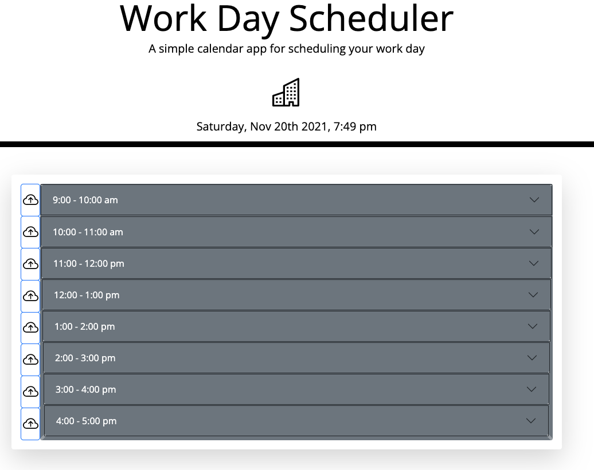

    
# Work Day Schedule Assistant

## License

## Description
    
A simple calendar app for scheduling events during a work day

## Screenshot

        

## Table of Contents

* [Installation](#installation)
* [Usage](#usage)
* [Credits](#credits)
* [License](#license)
* [Tests](#tests)
* [Questions](#questions)
    
## Installation

Clone the repo, then open index.html from your code editor.

## Usage

The app calendar is divided into accordion-style time blocks during a typical 9am-5pm work day. Upon clicking a time-block the accordion will expand to reveal an input field for an event. Then, the event can be saved with the adjacent 'cloud' button (event is stored to the browser localstorage). Lastly, the current time and date is displayed onload, and the time-blocks colorize during the progression of the workday (past = grey blocks, now = blue block, future = green blocks). The app has been optimized for mobile use with media-queries.

## Deployed App

[Work Day Schedule Assistant](https://coderjake91.github.io/work-day-schedule-assistant/)

## Credits

*[@coding-boot-camp](https://github.com/coding-boot-camp)

## Contributing

## Tests
no current test method

## Questions

Please send additional questions to [@coderjake91](https://github.com/coderjake91), email: jacob.b.frazer@gmail.com